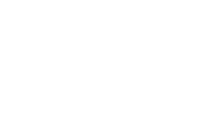
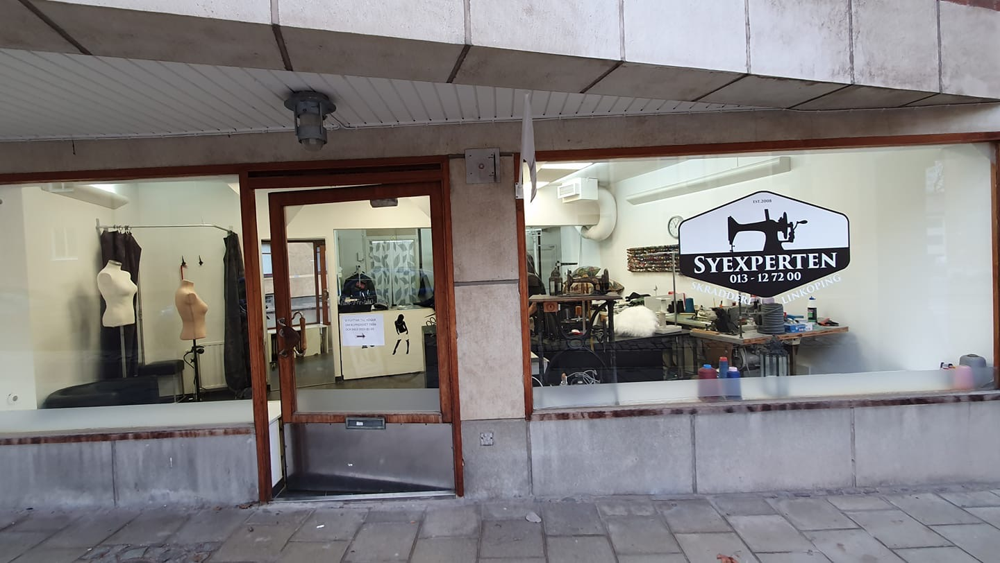
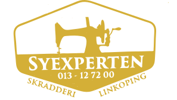

<!DOCTYPE html>
<html lang="sv">
<head>
  <meta charset="UTF-8" />
  <meta name="viewport" content="width=device-width, initial-scale=1.0"/>
  <title>SyExperten | Skräddarsydd Elegans i Linköping</title>
  <meta name="description" content="SyExperten - Din adress för skräddarsydd lyx i Linköping. Vi förvandlar textil till konstverk med exceptionell hantverksskicklighet.">
  
  <link rel="stylesheet" href="https://cdnjs.cloudflare.com/ajax/libs/font-awesome/6.4.0/css/all.min.css">
  
  
</head>

<!-- Add this script before </body> -->

<body class="font-sans thread-cursor">

  <!-- Navigationsmeny -->
  <nav class="fixed top-0 w-full bg-primary/95 backdrop-blur-md z-50 border-b border-gold transition-all duration-500">
    

      

        
SYEXPERTEN

        

        

          
        

      

      
      

        <a href="#tjanster" class="nav-link text-light/90 hover:text-secondary font-medium transition duration-300 flex items-center gap-2">
          <i class="fas fa-scissors text-secondary"></i> Tjänster
        </a>
        <a href="#omoss" class="nav-link text-light/90 hover:text-secondary font-medium transition duration-300 flex items-center gap-2">
          <i class="fas fa-store text-secondary"></i> Om oss
        </a>
        <a href="#oppettider" class="nav-link text-light/90 hover:text-secondary font-medium transition duration-300 flex items-center gap-2">
          <i class="far fa-clock text-secondary"></i> Öppettider
        </a>
        <a href="#kontakt" class="nav-link text-light/90 hover:text-secondary font-medium transition duration-300 flex items-center gap-2">
          <i class="fas fa-map-marker-alt text-secondary"></i> Kontakt
        </a>
      

      
      

        <a href="tel:013127200" class="luxury-btn bg-transparent border-2 border-secondary hover:bg-secondary/10 text-secondary font-medium px-6 py-3 rounded-sm transition duration-300 flex items-center gap-3 group">
          <i class="fas fa-phone transform group-hover:scale-110 transition"></i> 
          013-12 72 00
        </a>
      

    

  </nav>

  <!-- Hero-bild -->
  

    <!-- Background image with enhanced filters -->
    

      
      

      

    

  
    <!-- Content overlay -->
    

      <!-- Logo with enhanced visibility -->
      

        
      

      
      <!-- Headline with decorative elements -->
      

        <h1 class="text-4xl md:text-6xl lg:text-7xl font-heading font-bold text-light max-w-4xl mb-8 leading-tight hero-text animate-fade-in">
          Skräddarsydd Elegans
        </h1>
        

      

      
      <!-- Subheading with golden animation -->
      

        Perfektion i varje stygn sedan 2005
      

      
      <!-- Buttons with luxury effects -->
      

        <a href="#kontakt" class="luxury-btn bg-secondary hover:bg-opacity-90 text-dark font-bold py-4 px-10 rounded-sm transition duration-300 flex items-center gap-3 group relative overflow-hidden">
          Boka Konsultation
          <i class="fas fa-gem transform group-hover:scale-110 transition"></i>
        </a>
        <a href="#tjanster" class="luxury-btn bg-transparent border-2 border-secondary hover:bg-secondary/10 text-secondary font-bold py-4 px-10 rounded-sm transition duration-300 flex items-center gap-3 group">
          Våra Tjänster
          <i class="fas fa-chevron-down transform group-hover:scale-110 transition"></i>
        </a>
      

      
      <!-- Scroll indicator -->
      

        <a href="#content-start" class="text-secondary text-2xl scroll-indicator">
          <i class="fas fa-chevron-down"></i>
        </a>
      

    

  

  <!-- Main content anchor -->
  

  <!-- Huvudinnehåll -->
  <main class="max-w-7xl mx-auto px-6 py-20">

    <!-- Välkomsttext -->
    <section class="mb-28 text-center max-w-5xl mx-auto">
      
        HANDGJORD LYX
      
      <h2 class="text-5xl md:text-6xl font-heading font-bold mb-10 leading-tight text-light">Välkommen till SyExperten</h2>
      

      

        I hjärtat av Linköping skapar vi skräddarsydda mästerverk som kombinerar tidlös elegans med modern komfort. 
        Varje plagg som lämnar vår ateljé bär på en historia av exceptionellt hantverk och oöverträffad kvalitet.
      

      

        <a href="#omoss" class="inline-flex items-center text-secondary font-medium group golden-underline">
          Upptäck vår historia
          <i class="fas fa-arrow-right ml-3 transform group-hover:translate-x-2 transition duration-300"></i>
        </a>
      

    </section>

    <!-- Tjänster -->
    <section id="tjanster" class="mb-32">
      

        
          VÅRT HANTVERK
        
        <h2 class="text-5xl md:text-6xl font-heading font-bold mb-8 leading-tight text-light stitch-effect">Tjänster</h2>
        

        

          Från diskreta anpassningar till spektakulära specialbeställningar - vi förverkligar dina textildrömmar
        

      

      
      

        <!-- Tjänst 1 - Skräddarsytt arbete -->
        

          

            
          

          

            
              MÄTTAGNING
            
            <h3 class="text-3xl font-heading font-bold mb-4">Skräddarsytt Arbete</h3>
            
Perfekt anpassning efter dina unika mått och stilpreferenser.

            <a href="#kontakt" class="inline-flex items-center text-secondary font-medium group golden-underline">
              Boka Mätning
              <i class="fas fa-arrow-right ml-3 transform group-hover:translate-x-2 transition duration-300"></i>
            </a>
          

        

        
        <!-- Tjänst 2 - Reparation & Lagning -->
        

          

            
          

          

            
              RESTAURERING
            
            <h3 class="text-3xl font-heading font-bold mb-4">Reparation & Lagning</h3>
            
Expertis som ger dina favoritplagg nytt liv med osynliga ingrepp.

            <a href="#kontakt" class="inline-flex items-center text-secondary font-medium group golden-underline">
              Få Kostnadsförslag
              <i class="fas fa-arrow-right ml-3 transform group-hover:translate-x-2 transition duration-300"></i>
            </a>
          

        

        
        <!-- Tjänst 3 - Specialarbeten -->
        

          

            
          

          

            
              HAUTE COUTURE
            
            <h3 class="text-3xl font-heading font-bold mb-4">Specialarbeten</h3>
            
Unika kreationer för bröllop, galor och speciella tillfällen.

            <a href="#kontakt" class="inline-flex items-center text-secondary font-medium group golden-underline">
              Boka Konsultation
              <i class="fas fa-arrow-right ml-3 transform group-hover:translate-x-2 transition duration-300"></i>
            </a>
          

        

      

    </section>

    <!-- Om oss -->
    <section id="omoss" class="mb-32 py-24 bg-accent relative overflow-hidden">
      <!-- Sophisticated grain texture (almost invisible but adds depth) -->
      

      
      

        

          

            
              VÅR FILOSOFI
            
            <h2 class="text-5xl md:text-6xl font-heading font-bold mb-10 leading-tight text-light stitch-effect">Konsten Att Skapa</h2>
            

            

              
Sedan vår grundande har vi dedikerat oss till att bevara och utveckla det äkta skräddarhantverket. Varje plagg som lämnar vår ateljé bär på en historia av noggrannhet och passion.

              
Vår vision sträcker sig bortom vanlig skräddarsydd - vi skapar kläder som inte bara passar perfekt, men som också förmedlar en känsla av unik elegans och självförtroende.

              
Med en kombination av traditionella tekniker och moderna innovationer säkerställer vi att varje detalj är perfekt.

            

            

              
                <i class="fas fa-check-circle text-secondary text-glow"></i> Expertis sedan 2005
              
              
                <i class="fas fa-check-circle text-secondary text-glow"></i> Exklusiva Material
              
              
                <i class="fas fa-check-circle text-secondary text-glow"></i> Personlig Service
              
            

          

          

            

            
            

              

                <h3 class="font-heading text-3xl font-bold mb-3">Möt Vår Mästerskräddare</h3>
                
Fattho Abdul Ahad, med över 20 års erfarenhet av högklassig skräddarsydd, leder vårt team av hantverkare.

                <a href="#kontakt" class="inline-flex items-center text-secondary font-medium group golden-underline">
                  Boka Rådgivning
                  <i class="fas fa-arrow-right ml-3 transform group-hover:translate-x-2 transition duration-300"></i>
                </a>
              

            

          

        

      

    </section>

    <!-- Replace the Testimonials section with this code -->
    <section class="mb-32">
      

        

          
            VÅRA KUNDERS RÖSTER
          
          <h2 class="text-5xl md:text-6xl font-heading font-bold mb-8 leading-tight text-light stitch-effect">Kundrecensioner</h2>
          

          

            Vad våra nöjda kunder säger om oss
          

        

        
        <!-- Reviews Container -->
        

          <!-- Review 1 -->
          

            

              

                <i class="fas fa-star"></i><i class="fas fa-star"></i><i class="fas fa-star"></i><i class="fas fa-star"></i><i class="fas fa-star"></i>
              

              2 veckor sedan
            

            
"Fantastisk service! Fattho fixade min favoritklänning som var trasig på ett osynligt sätt. Kommer definitivt tillbaka."

            

              

                
              

              

                <h4 class="font-bold text-light">Emma Karlsson</h4>
                
Nöjd kund

              

            

          

          
          <!-- Review 2 -->
          

            

              

                <i class="fas fa-star"></i><i class="fas fa-star"></i><i class="fas fa-star"></i><i class="fas fa-star"></i><i class="fas fa-star"></i>
              

              1 månad sedan
            

            
"Bästa skräddaren i Linköping. Har anpassat flera kostymer åt mig och resultatet är alltid perfekt."

            

              

                
              

              

                <h4 class="font-bold text-light">Anders Berg</h4>
                
Återkommande kund

              

            

          

          
          <!-- Review 3 -->
          

            

              

                <i class="fas fa-star"></i><i class="fas fa-star"></i><i class="fas fa-star"></i><i class="fas fa-star"></i><i class="fas fa-star"></i>
              

              3 månader sedan
            

            
"Min bröllopsklänning blev precis som jag drömt om. Professionell service och hög kvalité."

            

              

                
              

              

                <h4 class="font-bold text-light">Lisa Nordström</h4>
                
Bröllopskund

              

            

          

        

        
        <!-- Google Badge Link -->
        

          <a href="https://www.google.com/maps/place/Syexperten+I+Linköping/@58.4091145,15.6150206,16z/data=!4m8!3m7!1s0x46596f2327695555:0xd35278e54bd45255!8m2!3d58.4078106!4d15.617338!9m1!1b1!16s%2Fg%2F11fmvl3gff?hl=sv&entry=ttu&g_ep=EgoyMDI1MDQwOS4wIKXMDSoJLDEwMjExNDUzSAFQAw%3D%3D" 
            target="_blank" 
            class="inline-flex items-center bg-primary hover:bg-opacity-90 border border-gold text-light font-bold py-4 px-8 rounded-sm transition duration-300 group">
            <i class="fab fa-google mr-3 text-secondary"></i>
            Lämna en recension på Google
            <i class="fas fa-arrow-right ml-3 transform group-hover:translate-x-2 transition"></i>
          </a>
        

      

    </section>

    <!-- Öppettider -->
    <section id="oppettider" class="mb-32 bg-primary/50 rounded-sm border border-gold p-12 md:p-16 backdrop-blur-sm">
      

        

          <h2 class="text-5xl md:text-6xl font-heading font-bold mb-8 leading-tight text-light stitch-effect">Besök Vår Ateljé</h2>
          

          

            Vår exklusiva verkstad i Linköpings fina innerstad
          

        

        
        

          

            <h3 class="text-3xl font-heading font-bold mb-8 text-light">Öppettider</h3>
            <ul class="space-y-6">
              <li class="flex justify-between items-center pb-4 border-b border-gold">
                Måndag - Fredag
                10:00 - 18:00
              </li>
              <li class="flex justify-between items-center pb-4 border-b border-gold">
                Lördag
                Stängt
              </li>
              <li class="flex justify-between items-center pb-4 border-b border-gold">
                Söndag
                Stängt
              </li>
            </ul>
            
            

              
<i class="fas fa-info-circle mr-3"></i> För bästa service rekommenderar vi att boka tid i förväg via vår bokningsfunktion

            

          

          
          

            <h3 class="text-3xl font-heading font-bold mb-8 text-light">Kontaktinformation</h3>
            

              

                

                  <i class="fas fa-map-marker-alt text-xl"></i>
                

                

                  <h4 class="font-bold text-xl text-light mb-2">Ateljé</h4>
                  
Elsa Brändströms gata 1 582 27 Linköping

                  <a href="https://maps.google.com" target="_blank" class="inline-flex items-center text-secondary font-medium group golden-underline">
                    Visa på karta
                    <i class="fas fa-external-link-alt ml-3 text-xs transform group-hover:translate-x-1 transition"></i>
                  </a>
                

              

              
              

                

                  <i class="fas fa-phone-alt text-xl"></i>
                

                

                  <h4 class="font-bold text-xl text-light mb-2">Telefon</h4>
                  
013-12 72 00

                  <a href="tel:013127200" class="inline-flex bg-secondary text-dark px-6 py-3 rounded-sm font-medium hover:bg-opacity-90 transition items-center gap-3 luxury-btn">
                    <i class="fas fa-phone"></i> 
                    Ring oss direkt
                  </a>
                

              

              
              

                

                  <i class="fas fa-envelope text-xl"></i>
                

                

                  <h4 class="font-bold text-xl text-light mb-2">E-post</h4>
                  
info@syexperten.se

                  <a href="mailto:info@syexperten.se" class="inline-flex bg-primary text-light px-6 py-3 rounded-sm font-medium hover:bg-opacity-90 transition items-center gap-3 border border-gold luxury-btn">
                    <i class="fas fa-envelope"></i> 
                    Skicka meddelande
                  </a>
                

              

            

          

        

      

    </section>

    <!-- Kontakt -->
    <section id="kontakt" class="mb-32">
      

        

          
            BOKNING
          
          <h2 class="text-5xl md:text-6xl font-heading font-bold mb-8 leading-tight text-light stitch-effect">Boka En Privat Konsultation</h2>
          

          

            Berätta om ditt projekt så återkommer vi med en exklusiv tid och detaljerat kostnadsförslag.
          

          
          <form class="space-y-8">
            

              

                <label for="name" class="block text-sm font-medium text-light/80 mb-2">Namn *</label>
                <input type="text" id="name" name="name" required class="w-full px-5 py-4 bg-primary/30 border border-gold rounded-sm focus:ring-2 focus:ring-secondary focus:border-transparent text-light placeholder-light/30">
              

              

                <label for="email" class="block text-sm font-medium text-light/80 mb-2">E-post *</label>
                <input type="email" id="email" name="email" required class="w-full px-5 py-4 bg-primary/30 border border-gold rounded-sm focus:ring-2 focus:ring-secondary focus:border-transparent text-light placeholder-light/30">
              

            

            
            

              <label for="phone" class="block text-sm font-medium text-light/80 mb-2">Telefon</label>
              <input type="tel" id="phone" name="phone" class="w-full px-5 py-4 bg-primary/30 border border-gold rounded-sm focus:ring-2 focus:ring-secondary focus:border-transparent text-light placeholder-light/30">
            

            
            

              <label for="service" class="block text-sm font-medium text-light/80 mb-2">Tjänst *</label>
              <select id="service" name="service" required class="w-full px-5 py-4 bg-primary/30 border border-gold rounded-sm focus:ring-2 focus:ring-secondary focus:border-transparent text-light">
                <option value="" class="bg-primary">Välj tjänst</option>
                <option value="tailoring" class="bg-primary">Skräddarsytt arbete</option>
                <option value="repair" class="bg-primary">Reparation & lagning</option>
                <option value="special" class="bg-primary">Specialarbeten</option>
                <option value="other" class="bg-primary">Privat rådgivning</option>
              </select>
            

            
            

              <label for="message" class="block text-sm font-medium text-light/80 mb-2">Beskriv ditt projekt *</label>
              <textarea id="message" name="message" rows="5" required class="w-full px-5 py-4 bg-primary/30 border border-gold rounded-sm focus:ring-2 focus:ring-secondary focus:border-transparent text-light placeholder-light/30"></textarea>
            

            
            <button type="submit" class="w-full bg-secondary hover:bg-opacity-90 text-dark font-bold py-5 px-8 rounded-sm transition duration-300 flex items-center justify-center gap-4 group luxury-btn">
              Skicka Förfrågan
              <i class="fas fa-paper-plane transform group-hover:scale-125 transition"></i>
            </button>
          </form>
        

        
        

          <iframe 
            src="https://www.google.com/maps/embed?pb=!1m18!1m12!1m3!1d2079.869403873527!2d15.6012223159287!3d58.41090038124695!2m3!1f0!2f0!3f0!3m2!1i1024!2i768!4f13.1!3m3!1m2!1s0x46596bc8b3b8e6d5%3A0x3e8a0d7c8a7a7a7a!2sElsa%20Br%C3%A4ndstr%C3%B6ms%20gata%201%2C%20582%2027%20Link%C3%B6ping!5e0!3m2!1ssv!2sse!4v1620000000000!5m2!1ssv!2sse" 
            width="100%" 
            height="100%" 
            style="border:0;" 
            allowfullscreen="" 
            loading="lazy"
            class="min-h-[400px]"
          ></iframe>
          

        

      

    </section>
  </main>

  <!-- Footer -->
  <footer class="bg-primary text-light pt-24 pb-16 relative border-t border-gold">
    

    

      

        

          

            
SYEXPERTEN

            

            
          

          
Exklusiv skräddarservice i Linköping sedan 2005.

          

            <a href="#" class="w-12 h-12 bg-accent hover:bg-secondary rounded-full flex items-center justify-center transition border border-gold text-secondary hover:text-dark">
              <i class="fab fa-facebook-f text-lg"></i>
            </a>
            <a href="#" class="w-12 h-12 bg-accent hover:bg-secondary rounded-full flex items-center justify-center transition border border-gold text-secondary hover:text-dark">
              <i class="fab fa-instagram text-lg"></i>
            </a>
          

        

        
        

          <h3 class="text-lg font-bold mb-6 uppercase tracking-wider text-light">Tjänster</h3>
          <ul class="space-y-3">
            <li><a href="#" class="text-light/60 hover:text-secondary transition flex items-center gap-3">
              <i class="fas fa-chevron-right text-xs text-secondary"></i> Skräddarsytt arbete
            </a></li>
            <li><a href="#" class="text-light/60 hover:text-secondary transition flex items-center gap-3">
              <i class="fas fa-chevron-right text-xs text-secondary"></i> Reparation & lagning
            </a></li>
            <li><a href="#" class="text-light/60 hover:text-secondary transition flex items-center gap-3">
              <i class="fas fa-chevron-right text-xs text-secondary"></i> Specialarbeten
            </a></li>
            <li><a href="#" class="text-light/60 hover:text-secondary transition flex items-center gap-3">
              <i class="fas fa-chevron-right text-xs text-secondary"></i> Bröllopsklänningar
            </a></li>
            <li><a href="#" class="text-light/60 hover:text-secondary transition flex items-center gap-3">
              <i class="fas fa-chevron-right text-xs text-secondary"></i> Kostymanpassning
            </a></li>
          </ul>
        

        
        

          <h3 class="text-lg font-bold mb-6 uppercase tracking-wider text-light">Kontakt</h3>
          <ul class="space-y-4 text-light/60">
            <li class="flex items-start gap-4">
              <i class="fas fa-map-marker-alt mt-1 text-secondary"></i> 
              Elsa Brändströms gata 1 582 27 Linköping
            </li>
            <li class="flex items-center gap-4">
              <i class="fas fa-phone-alt text-secondary"></i> 
              013-12 72 00
            </li>
            <li class="flex items-center gap-4">
              <i class="fas fa-envelope text-secondary"></i> 
              info@syexperten.se
            </li>
          </ul>
        

        
        

          <h3 class="text-lg font-bold mb-6 uppercase tracking-wider text-light">Nyhetsbrev</h3>
          
Prenumerera för exklusiva erbjudanden och stylingtips.

          <form class="flex">
            <input type="email" placeholder="Din e-post" class="px-5 py-3 w-full rounded-l-sm bg-accent text-light border border-gold focus:ring-2 focus:ring-secondary focus:border-transparent placeholder-light/30">
            <button type="submit" class="bg-secondary text-dark px-5 rounded-r-sm hover:bg-opacity-90 transition border border-secondary">
              <i class="fas fa-paper-plane"></i>
            </button>
          </form>
        

      

      
      

        

          &copy; 2025 SyExperten. Alla rättigheter förbehållna.
        

        

          <a href="#" class="text-light/40 hover:text-secondary text-sm transition golden-underline">Integritetspolicy</a>
          <a href="#" class="text-light/40 hover:text-secondary text-sm transition golden-underline">Villkor</a>
          <a href="#" class="text-light/40 hover:text-secondary text-sm transition golden-underline">Cookies</a>
        

      

    

  </footer>

  <!-- Floating action button -->
  <a href="#kontakt" class="fixed bottom-8 right-8 w-16 h-16 bg-secondary text-dark rounded-full flex items-center justify-center shadow-2xl hover:bg-opacity-90 transition z-50 floating-btn group">
    <i class="fas fa-calendar-alt text-xl transform group-hover:scale-125 transition"></i>
  </a>

  

</body>
</html>
